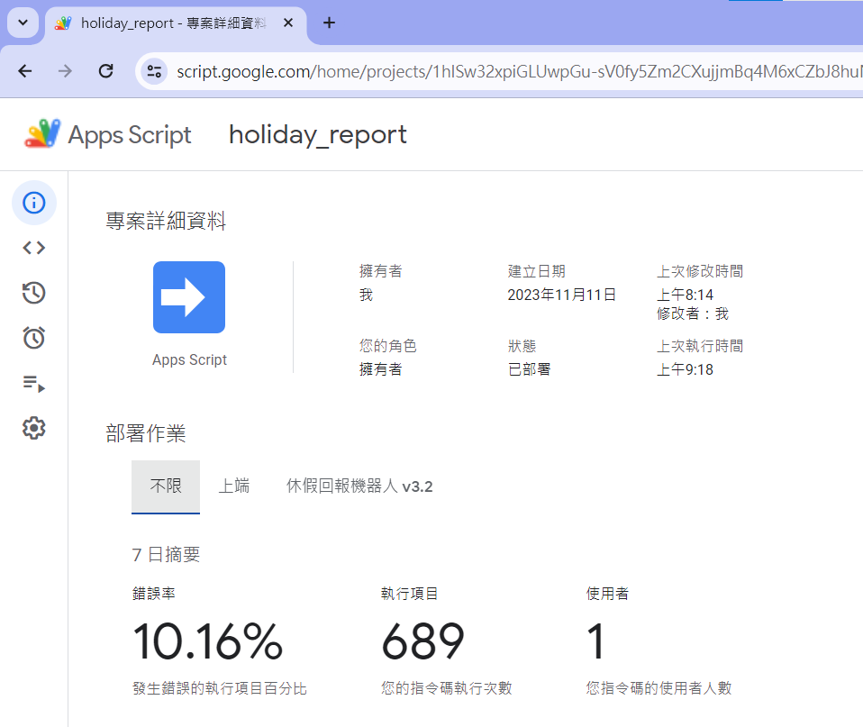

# holiday-report-linebot
A LINE Bot deals with the regular vacation report (army).

# Introduction
當兵休假需要在 11:00 和 18:00 定時回報，由各班班頭統整後回報到大群(LINE)  
由於本人是洞洞么(一班班頭)，每次都要整理一班十七員的回報和艾特未回報的人，故自動化此流程  
<ol>
  <li>擷取符合回報格式的留言 (1-001 某某某 做什麼) </li>
  <li>輸入關鍵字回傳表單 (1班休假回報) </li>
</ol>
因為個人方便，此機器人功能簡單且沒有防呆  
未完成:  
<ol>
  <li>時間到自動艾特未回報人員</li>
  <li>全員回報完畢後自動回報</li>
</ol>
詳細實作流程參考 <a href="https://github.com/jschang19/plusone-linebot">LINE 加一紀錄機器人 （ PlusOne Bot ）<a>  

# Preview
   
   
  
